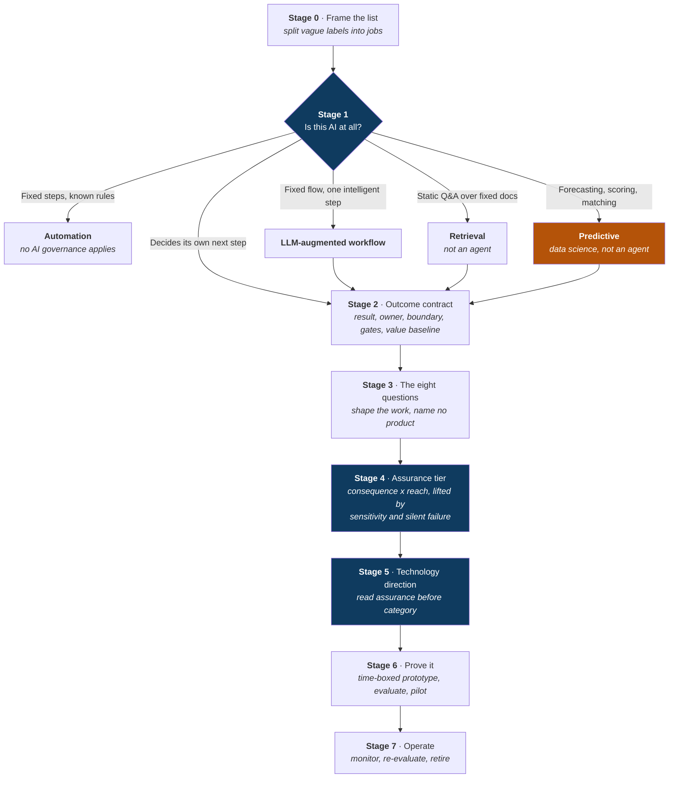

# Turning an idea list into working agents

**A decision framework for taking a list of AI ideas and turning it into a prioritised set of projects — where the technology falls out of the answers rather than being the starting assumption.**

Builds on the publicly available [Microsoft Cloud Adoption Framework for AI agents](https://learn.microsoft.com/en-us/azure/cloud-adoption-framework/ai-agents/).

> ### ⚠️ Independent work — not Microsoft guidance
>
> This framework is **my own professional opinion and recommendations**. It is not official Microsoft guidance, not a Microsoft product, and not endorsed by or affiliated with Microsoft Corporation. It builds on Microsoft's *public* documentation, which is linked throughout and remains authoritative where the two differ.
>
> It is **not legal, regulatory, privacy or clinical advice**, and it carries **no licensing or pricing information** — confirm those with Microsoft directly.
>
> **[Read the full disclaimer →](DISCLAIMER.md)** · **[What is Microsoft's and what is mine →](docs/appendix-d-sources.md)**

---

## The problem this solves

Every organisation arrives at AI with a list of ideas and a question about which product to buy. Starting there is why so many pilots stall.

Take one line item that appears on almost every list:

> **"Build us an HR assistant."**

Four things are already wrong with it, and they compound:

| Failure mode | What goes wrong with *"an HR assistant"* |
| --- | --- |
| **Vague scope** | That is not one build, it is **four**: explain a policy, look up my leave balance, submit a leave request, and escalate a grievance. One is read-only reference. One touches personal data. One **writes to payroll**. One should never be automated at all. Scored as a single row, whatever you decide is wrong for three of them. |
| **Product first** | Someone says *"so it's a chatbot"* in the first ten minutes, because chat is what people have seen. Now the leave balance — which could have been a field already filled in on a form — is something you have to open a window and ask for. |
| **No named owner** | Ask *"who decides this is working?"* and you get a department, not a person. So when the demo lands, the loudest voice in the room defines success, and there is nothing to hold the build to. |
| **No cost of failure** | Nobody asked what happens when it gets a policy wrong. Tells someone the wrong notice period? Awkward. Submits leave against the wrong entitlement? That is a payroll correction. Same "assistant", wildly different bar — and nobody set one. |

**The fix is sequencing.** Describe the work first and let the technology be a consequence, not a starting assumption.

Split that one line into four jobs and the answers separate immediately: *explain a policy* is a read-only retrieval job that ships in a fortnight, and *submit a leave request* writes to a system of record and needs an owner, a boundary and a human check. Same original request. Two completely different projects, and one of them was never AI at all.

---

## The shape of it

Eight stages, sitting underneath the Cloud Adoption Framework's four phases. This is not a competing framework.

**In one sentence:** clean up the list, throw out the things that aren't AI, agree what *working* means, ask eight questions about the shape of the work — and by then the technology has chosen itself.



**Four of the eight stages sit inside Plan** — everything up to and including the eight questions. That is deliberate, and it is exactly where most organisations skip straight past to picking a product.

It also gives you a useful, undramatic sentence for a steering committee: *"we can't answer Stages 0 to 3 yet, so we're not ready to talk about technology."* That is a much easier thing to say early than to explain later.

---

## The guide

Each page is one stage, and each answers a question you can actually ask in a room.

| | Stage | The question it answers |
| --- | --- | --- |
| | [Why idea lists stall](docs/00-why-idea-lists-stall.md) | *Why did our last three pilots go nowhere?* |
| **0** | [Frame the list](docs/01-stage-0-frame-the-list.md) | *Is this one job, or four wearing one label?* |
| **1** | [Is this AI at all?](docs/02-stage-1-is-this-ai.md) | *Does this need AI, or have we just assumed it does?* |
| **2** | [The outcome contract](docs/03-stage-2-outcome-contract.md) | *What number moves, who owns it, and what will it refuse to do?* |
| **3** | [The eight questions](docs/04-stage-3-eight-questions.md) | *What shape is this work?* — the core of the method |
| **4** | [Assurance tier and release gate](docs/05-stage-4-assurance.md) | *How careful do we have to be, and who signs it off?* |
| **5** | [Technology direction](docs/06-stage-5-technology-direction.md) | *So what do we actually build it on?* |
| **6** | [Prove it](docs/07-stage-6-prove-it.md) | *How do we know it works before we ship it?* |
| **7** | [Operate](docs/08-stage-7-operate.md) | *It's live. How do we know it still works?* |
| | [Running it over a list](docs/09-running-it-over-a-list.md) | *We have 17 of these. Where do we start?* |

**Appendices**

- [A · The verb card](docs/appendix-a-verb-card.md) — one page. Ask which *sentence* they'd say, and the platform falls out
- [B · The workbook](docs/appendix-b-workbook.md) — how the spreadsheet works, column by column
- [C · Facilitation notes](docs/appendix-c-facilitation.md) — who to get in the room, and what reliably goes wrong
- [D · Sources](docs/appendix-d-sources.md) — what is Microsoft's and what is mine

> **In a hurry?** Read [the eight questions](docs/04-stage-3-eight-questions.md). If you only take one thing from this repository, take those — everything else exists to set them up or act on their answers.

---

## The workbook

The framework is only useful if it runs over a list. [`assets/`](assets/) contains a working Excel workbook that implements every stage:

| File | What it is |
| --- | --- |
| [`AI Use Case Decision Workbook - v5.xlsx`](assets/AI%20Use%20Case%20Decision%20Workbook%20-%20v5.xlsx) | Blank template, 50 rows |
| [`SAMPLE - AI Use Case Decision Workbook - v5.xlsx`](assets/SAMPLE%20-%20AI%20Use%20Case%20Decision%20Workbook%20-%20v5.xlsx) | Two worked rows, so you can read the method without a customer in the room |

Thirteen sheets, ~3,650 formulas. You fill in the cream cells; the blue-grey ones calculate. Row *N* is the same use case on every sheet.

**What it works out for you:** the Stage 1 category, the assurance tier (with the working shown), the ladder rung, the verb and the product it lands on, the run-location constraints, whether it is a quick win — and if not, *the first failing test* — plus a per-row list of exactly what you still need from the customer.

To rebuild it, or to generate one pre-filled with your own rows:

```bash
cd workbook
npm install
npm run build          # blank template
npm run build:sample   # with the two worked examples
```

See [Appendix B](docs/appendix-b-workbook.md) for the column-by-column guide.

---

## The two worked examples

The sample workbook carries two deliberately contrasting rows. Every name, number and system in them is invented.

Both arrived on the original list described the same way: **"an AI assistant"**. Here is where they end up.

| | **UC-01** Policy assistant | **UC-02** Clinical visit scribe |
| --- | --- | --- |
| Stage 1 | Retrieval | Agent |
| Assurance | **Light touch** | **Full assurance** |
| Release gate | Passed | **Blocked** |
| Rung → lands on | 2 Ready-made → Declarative agent | 4 Pro-code → Foundry |
| Quick win? | **Yes** | No — *"It is an agent"* |
| Time | Weeks | Months, integration-led |
| Still needed | *nothing* | *"Owner after go-live"* |

UC-02 collects every awkward answer on purpose: regulated clinical data, has to work in a house with no mobile signal, no write API to the record system today, and a silent failure means a care note nobody files. It also has no named owner after go-live, which is why its release gate reads **Blocked** rather than *slow*.

**The point is not that UC-02 is bad.** It is probably the more valuable of the two. The point is that the workbook can say *precisely why* it is not a fortnight of work — in every column, with the working shown — instead of just asserting it in a steering committee.

---

## Start here

**If you have 5 minutes** — read [the eight questions](docs/04-stage-3-eight-questions.md). That is the method; the rest is scaffolding.

**If you have an hour** — read [Why idea lists stall](docs/00-why-idea-lists-stall.md), then the eight questions, then open the sample workbook and follow UC-01 and UC-02 across the sheets. Watching one row stay green and the other go red on every sheet explains the framework faster than the prose does.

**If you have a real list** — start at [Running it over a list](docs/09-running-it-over-a-list.md). Do the steps in the order given: sort by reach, throw out the non-agents, flag anything integration-led, *then* score what survives. Each step is cheaper than the next, so doing them out of order means doing detailed analysis on rows a thirty-second filter would have removed.

**If you are running a workshop** — [Appendix C](docs/appendix-c-facilitation.md) covers who needs to be in the room, and the six things that reliably go wrong.

---

## A note on product names

**The framework names capabilities. Capabilities outlive product names.**

Everything about *which product* is more volatile than everything about *which capability*. Names change, previews get renamed or withdrawn, and regional availability differs. So:

1. Keep product names out of the methodology and in the dated, versioned workbook.
2. Never recommend a preview product to a regulated customer as the plan. Name it as an option to watch, with the general availability position stated.
3. **Date every product claim**, and confirm before rollout.

**This repository carries no licensing, pricing or entitlement information, and none should be inferred.** Those terms are customer-specific, vary by agreement and region, and are not mine to state — confirm them with Microsoft or your account team. Product references were checked in **September 2026**.

---

## Contributing

Issues and pull requests welcome — see [CONTRIBUTING.md](CONTRIBUTING.md). The most useful contributions are places where the method gives a *wrong* answer on a real list. That is how v5 came about.

**Please de-identify.** No customer, client or employer information in issues, PRs or sample data.

## Licence and disclaimer

Documentation is [CC BY 4.0](LICENSE-DOCS). Code in `workbook/` is [MIT](LICENSE).

**This is independent work and not Microsoft guidance — please read [DISCLAIMER.md](DISCLAIMER.md).** [Appendix D](docs/appendix-d-sources.md) sets out exactly which parts are Microsoft's published guidance and which are mine.
